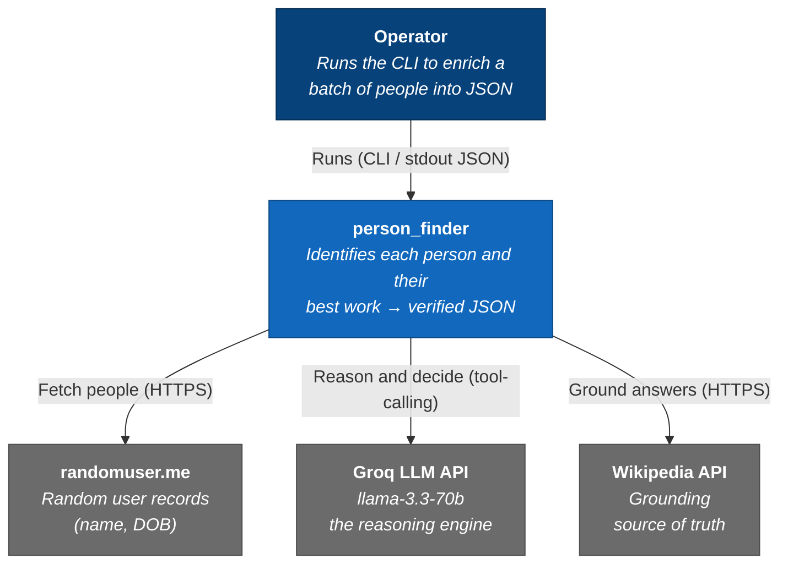

# C4 L1 — System Context

Who uses `person_finder` and what it depends on.

| Element | Type | Role |
|---|---|---|
| Operator | person | Triggers a run (CLI). No UI, no inbound API |
| person_finder | system | Batch enrichment: names → source-attributed facts |
| randomuser.me | external | Input — name + DOB |
| Groq LLM API | external | Reasoning / tool-calling decisions |
| Wikipedia API | external | Grounding source; answers tagged `wiki` vs `llm` |

**Notes**
- Batch system, no inbound traffic → no auth / LB / scaling at this level.
- Two non-deterministic/unreliable deps (LLM, public API) → reliability is engineered in-process, not assumed upstream.

➡️ [L2 Container](./c4-2-container.md)
