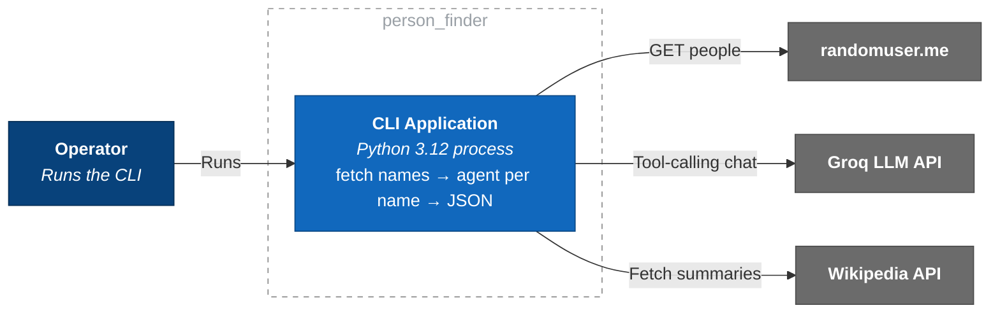

# C4 L2 — Container

Runnable units inside the system. ("Container" = process/datastore, not Docker.)

One synchronous process; sequential loop over ≤5 names.

**Notes**
- stdout = JSON, stderr = logs/errors (pipeable contract).
- Per-name work is independent and stateless (seam: `lookup_person_info`).

⬅️ [L1 Context](./c4-1-context.md) · ➡️ [L3 Component](./c4-3-component.md)
