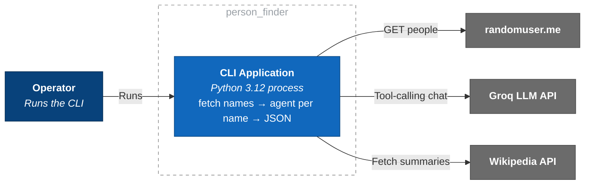
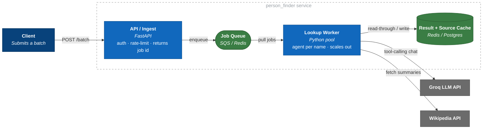

# C4 L2 — Container

Runnable units inside the system. ("Container" = process/datastore, not Docker.)

## Current — single-process CLI

One synchronous process; sequential loop over ≤5 names. Correct size for a 5-item batch.

## Evolved — as a service (scaling reference)

| Concern | CLI today | Service |
|---|---|---|
| Concurrency | sequential loop | worker pool off a queue |
| Spikes | operator-paced | queue absorbs / back-pressure |
| Cost + latency | re-asks LLM each run | cache name→result + wiki summaries |
| Rate limits | surface + exit | token-bucket at edge + retry/backoff |
| Failure unit | per-row fallback | + dead-letter queue |

**Notes**
- Scaling axis = the per-name unit (independent, stateless). Seam already exists: `lookup_person_info`.
- First addition under load = cache (LLM + wiki calls dominate cost/latency; inputs repeat).
- stdout = JSON, stderr = logs/errors (pipeable contract).

⬅️ [L1 Context](./c4-1-context.md) · ➡️ [L3 Component](./c4-3-component.md)
