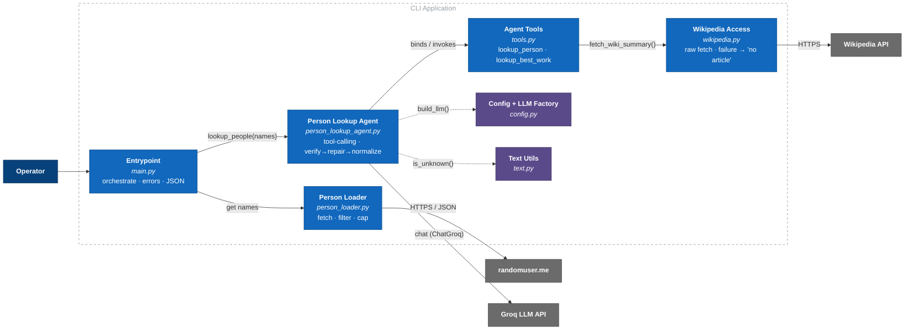
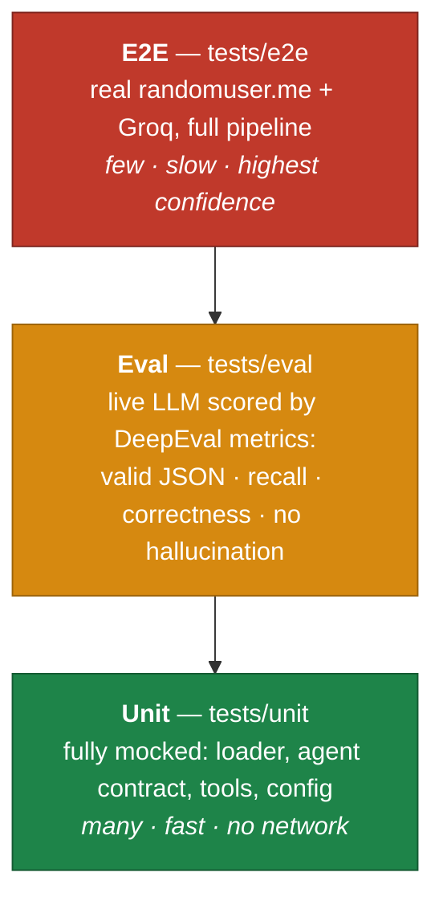

# C4 L3 — Component

Modules inside the CLI Application and how a run flows through them.

Solid edges = data flow · dotted = "uses" (helpers).

| Component | File | Responsibility |
|---|---|---|
| Entrypoint | `main.py` | wire pipeline, map errors, print |
| Person Loader | `person_loader.py` | fetch → filter (DOB ≤ 2000) → cap (≤5) |
| Person Lookup Agent | `person_lookup_agent.py` | own decision tree, enforce contract |
| Agent Tools | `tools.py` | expose Wikipedia as LLM tools |
| Wikipedia Access | `wikipedia.py` | wrap `wikipedia` lib |
| Config + LLM Factory | `config.py` | constants + one `ChatGroq` |
| Text Utils | `text.py` | `UNKNOWN` sentinel match |

## Defense in depth (every layer has a fallback)
| Failure | Caught in | Result |
|---|---|---|
| wiki miss / network | `wikipedia.py` | `None` → tool returns "no article" |
| tool finds nothing | agent (prompt) | fall back to model knowledge (`source:"llm"`) |
| can't identify | agent (prompt) | `UNKNOWN` → all fields null |
| contract violation | agent (`_verify`) | 1 repair retry → normalize to safe shape |
| randomuser/Groq down | `main.py` | clean stderr message, non-zero exit |

Smallest failure unit = one name / one field; nothing aborts the batch.

## Test pyramid (production-readiness proof)

- **Unit** — deterministic, mocked; proves plumbing + contract guard.
- **Eval** — LLM output can't use `==`; scored on validity / recall / correctness (LLM-judge) / precision (no hallucinated fictional names).
- **E2E** — full real pipeline; skips without `GROQ_API_KEY`.

⬅️ [L2 Container](./c4-2-container.md) · ➡️ [L4 Code](./c4-4-code.md)
