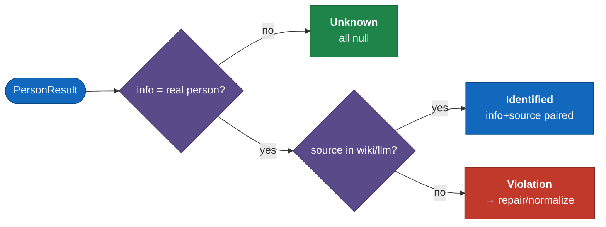
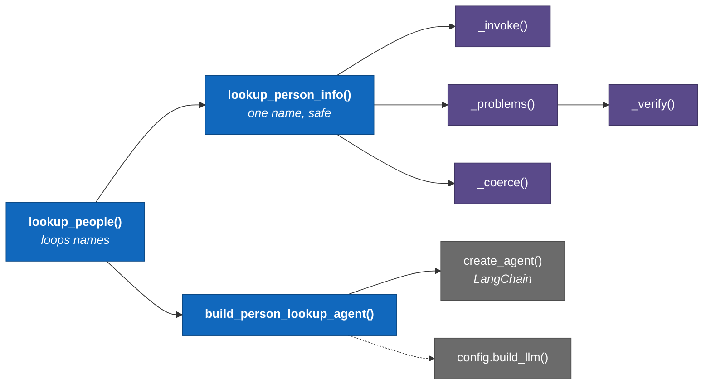
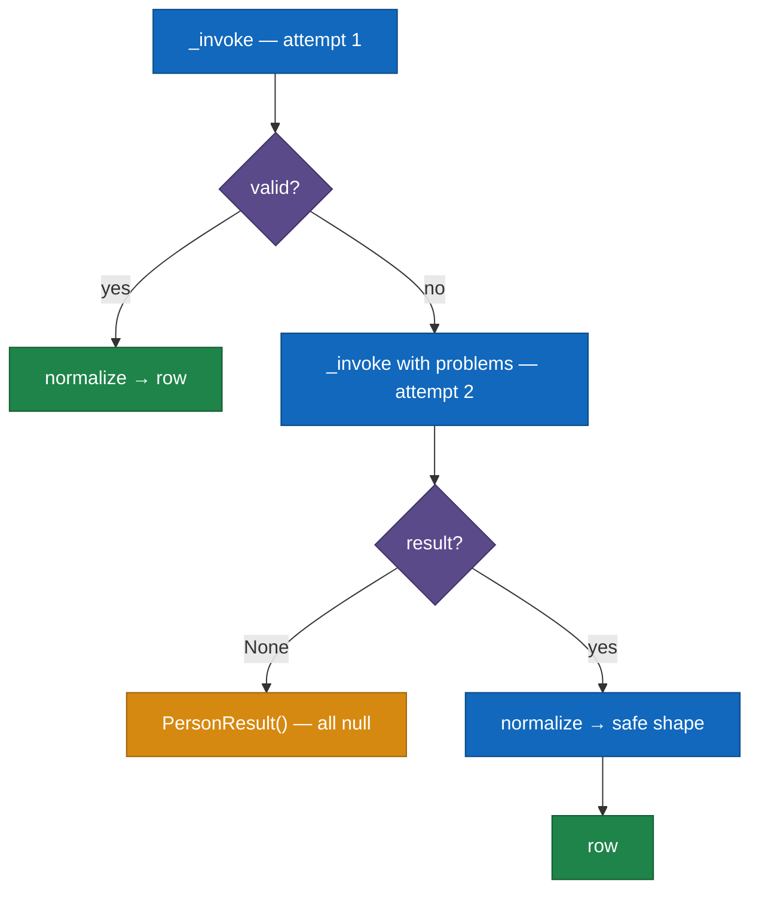
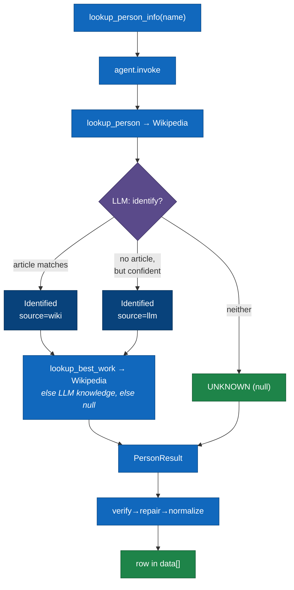

# C4 L4 — Code

Zoom into one component: **Person Lookup Agent** (`person_lookup_agent.py`) — where the LLM meets a strict contract. Other components stay at L3.

## Contract — `PersonResult`

| State | info | source | best_work |
|---|---|---|---|
| Unknown | null | null | null |
| Identified · grounded | set | `wiki` | set/null |
| Identified · from model | set | `llm` | set/null |

Invariants: `info`↔`source` paired; `best_work` only when identified.

## Call graph

Agent built once in `lookup_people`, reused across names.

## verify → repair → normalize

The third rung (`_coerce` in source) deterministically rewrites a still-invalid result into a guaranteed-valid shape — it never raises.

Pattern: validate boundary → bounded self-heal → deterministic degrade.

## Dynamic — one name

Agent (not our code) decides whether/when to call tools, per `SYSTEM_PROMPT`.

## Edge cases

| Failure | Handled in | Defense |
|---|---|---|
| no structured output | `_problems(None)` | violation → repair, else null row |
| duplicate structured call | `config.build_llm` | `parallel_tool_calls=False` |
| `"UNKNOWN"` / empty / `"unknown."` | `text.is_unknown` | case/punct-tolerant match |
| garbage `source` when identified | `_coerce` | default to `llm`, keep identification |
| wiki down / no article | `wikipedia.py` → `tools.py` | returns string, never raises |

**Notes**
- `_verify` / `_coerce` / `_identified` / `is_unknown` are pure → no-mock unit tests; only `_invoke` is impure.
- Unit tests feed a stub agent returning broken results, assert the row comes out valid.
- `SYSTEM_PROMPT` is version-controlled code, not a magic string.

⬅️ [L3 Component](./c4-3-component.md)
